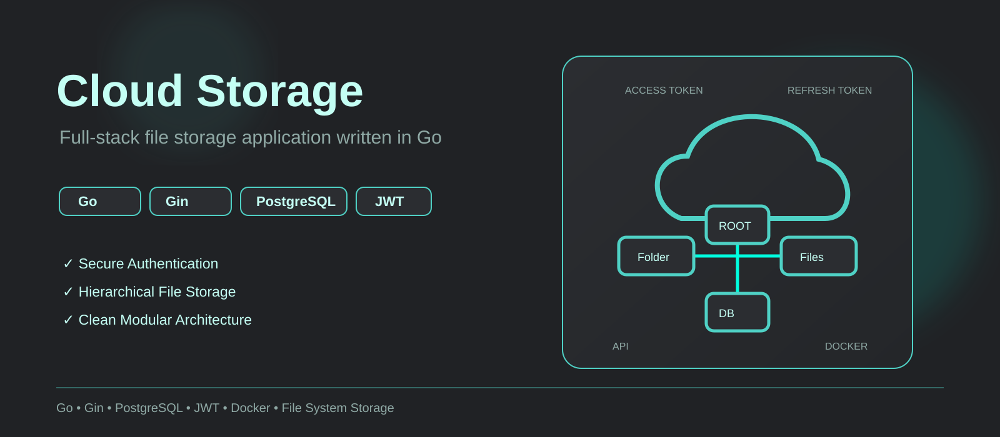
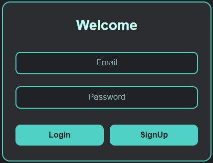
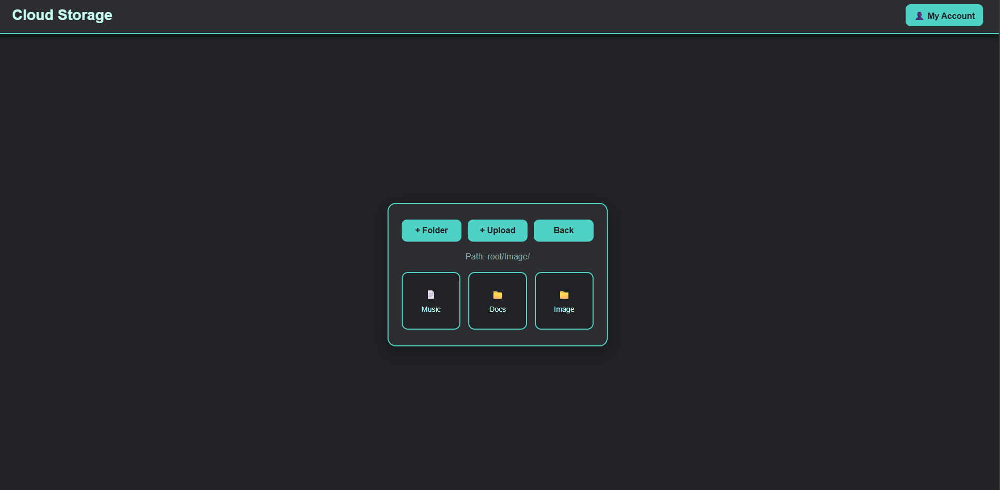
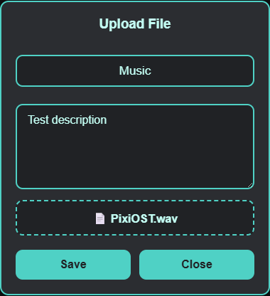
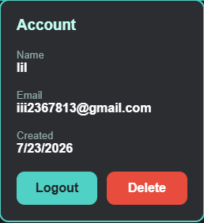
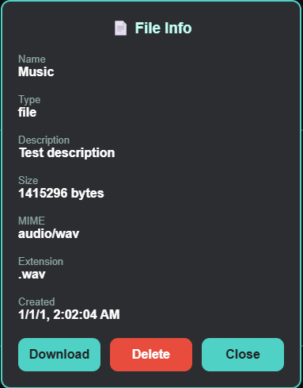

  

 

Cloud Storage is a full-stack file storage application written in Go.
The project focuses on backend architecture, authentication, and hierarchical file storage while providing a minimal web interface for interacting with the system.

## Appearance

<table align="center">
<tr>
<td align="center">
 
<b>Login</b>
</td>
</tr>

<tr>
<td align="center">
 
<b>Storage</b>
</td>
</tr>

<tr>
<td align="center">
 
<b>Upload</b>
</td>

<td align="center">
 
<b>Account</b>
</td>

<td align="center">
 
<b>File Information</b>
</td>
</tr>
</table>

## Features

**Authentication**
- User registration
- Login / Logout
- JWT authentication
- Access & Refresh tokens
- Refresh token rotation
- User sessions

**Storage**
- Hierarchical folder structure
- File upload
- File download
- File deletion
- Folder creation
- Tree navigation

**Infrastructure**
- PostgreSQL persistence
- Docker support
- Configuration via environment variables

## Architecture

The application follows a modular architecture with dependency injection and a simplified layering inspired by Clean Architecture principles.

### Modules

### Layer responsibilities

### Dependency graph

### Authentication

Authentication is based on JWT using Access and Refresh tokens.

Refresh tokens are stored as sessions in PostgreSQL and rotated on every refresh request.
Access and Refresh tokens use different signing secrets and configurable expiration times.

### Storage Design

Files are stored directly on the server's file system.

PostgreSQL stores only metadata describing the storage tree.
Each record represents either a file or a folder and belongs to a specific user.

This separates physical file storage from the logical representation of the directory tree.

## Technologies

| Technology          | Purpose          |
| ------------------- | ---------------- |
| Go                  | Backend          |
| Gin                 | HTTP Router      |
| PostgreSQL          | Metadata storage |
| JWT                 | Authentication   |
| Docker              | Containerization |
| HTML/CSS/JavaScript | Web interface    |

## Running locally

### Directory Layout

### Requirements
### Environment variables
### Docker
### Manual 

## API Overview

### Auth

| Method       | Endpoint   | Description   | 
| ------------ | ---------- |---------------|
| **POST**     | */signup*  |               |
| **POST**     | */login*   |               | 
| **POST**     | */refresh* |               | 
| **POST**     | */logout*  |               | 
| **GET**      | */me*      |               |
| **DELETE**   | */me*      |               |

### Storage

| Method       | Endpoint              | Description   | 
| ------------ | --------------------- |---------------|
| **GET**      | */tree*               |               |
| **GET**      | */tree/:id*           |               | 
| **POST**     | */folders*            |               | 
| **POST**     | */root*               |               | 
| **POST**     | */files*              |               |
| **DELETE**   | */nodes/:id*          |               |
| **GET**      | */files/:id/download* |               |

## Design Decisions

- Physical files are stored separately from metadata.
- Authentication is isolated into its own module.
- Business logic is independent from HTTP handlers.
- Repository interfaces decouple persistence from services.
- Each user has an isolated storage tree rooted at a dedicated root node.
